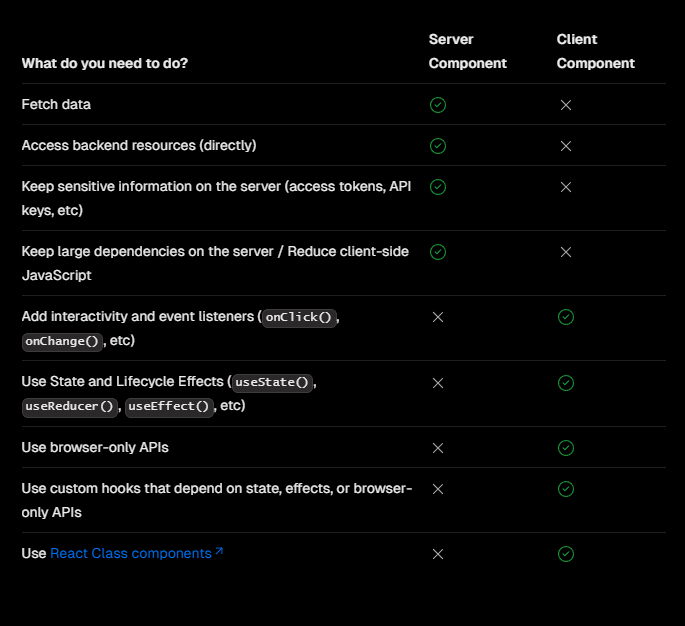

# Client Components & Next Router

All of our pages at the moment are server-rendered. This means that when we click on a link, the browser makes a request to the server and the server sends back the HTML for the page. This is great for SEO, but it's not great for interactivity. In fact, if you want to use any React hooks at all, you need to use a client component. A client component is a component that is rendered on the client-side. This means that the component is rendered in the browser and not on the server.

It can be confusing on when to use which, so there is a chart at https://nextjs.org/docs/app/building-your-application/rendering/composition-patterns



If you are just fetching some data or need access to backend resources directly, you can usually keep it as a server component. Obviously if you have sensitive data like api keys, you should keep it as a server component.

However if you want to add events and hooks and make the component interactive, you should use a client component. In fact, let's bring in the `useRouter` hook, because I want to show you that anyway.

## Making a Component a Client Component

Let's go into the `app/properties/[id]/page.jsx` file and add the following to the top of the file:

```jsx
import { useRouter } from 'next/navigation';
```

Once you save the file, you will get an error that says `Error: useRouter only works in Client Components`. This is because we are trying to use the `useRouter` hook in a server component. You can not use any hook in a server component. Let's change this to a client component.

We do this simply by adding the following to the top of the file:

```jsx
'use client';
```

Now the error should go away. That's all there is to making a server component into a client component.

## useRouter Hook

Now we can use the `useRouter` hook to get the router object. Let's add the following to the `PropertyPage` component:

```jsx
const router = useRouter();
```

Make sure that you put this line in the component/function body.

Let's see what that gives us. Add the following to the `PropertyPage` component:

```jsx
console.log(router);
```

Things have changed since Next 13 was released. You used to import the `useRouter` hook from `next/router`, but now you import it from `next/navigation`. You also used to be able to access things like query strings and the pathname directly from the router object, but now we do that with different hooks. I'll show you how to do that in a second. But let's see what the router object gives us.

We have the following functions:

- replace(): Replace the current page with a new one
- reload(): Reload the current page
- refresh(): Refresh the current page
- fastRefresh(): Refresh the current page (keeping the state)
- push(): Push a new page onto the stack
- back(): Go back to the previous page
- forward(): Go forward to the next page
- prefetch(): Prefetch a page

So let's say that I want to redirect the user to the homepage when they click on the "Back to Home" button. I can do that with the `replace` function. Let's add a temporary button to the `PropertyPage` component:

```jsx
<button className='block bg-blue-100 p-2' onClick={() => router.replace('/')}>
  Back to Home
</button>
```

I could also use the `push` function, but I don't want to add a new page to the stack. I want to replace the current page with the homepage.

You can remove the button.

## useParams Hook

So lets say that we want to get the id of the property from the params. We can do that with the `useParams` hook. Let's import it from `next/navigation`:

```jsx
import { useRouter, useParams } from 'next/navigation';
```

Now we can get the id from the params with the following:

```jsx
const { id } = useParams();
```

Let's log that out:

```jsx
console.log(id);
```

Now if you go to the property page, you should see the id in the console.

## useSearchParams Hook

There may be times where you need to get a query string. Let's say that we want to get the `name` query string from the url. We can do that with the `useSearchParams` hook. Let's import it from `next/navigation`:

```jsx
import { useRouter, useParams, useSearchParams } from 'next/navigation';
```

Add this to the function body:

```jsx
const searchParams = useSearchParams();
```

Now we can get the `name` query string with the following:

```jsx
const name = searchParams.get('name');
```

Let's log that out:

```jsx
console.log(name);
```

## usePathname

The last hook I'll show you from the Next router is the `usePathname` hook. Let's import it from `next/navigation`:

```jsx
import {
  useRouter,
  useParams,
  useSearchParams,
  usePathname,
} from 'next/navigation';
```

Initialize it and get the path name:

```jsx
const pathname = usePathname();
```

Let's log that out:

```jsx
console.log(pathname);
```

You should see the path name in the console.

Alright, so we don't need any of this at the moment, but I'll be stopping and explaining stuff like this throughout the course. You can bring this component back to the state it was in before we started this lesson:

```jsx
const PropertyPage = () => {
  return <div>PropertyPage</div>;
};
export default PropertyPage;
```
